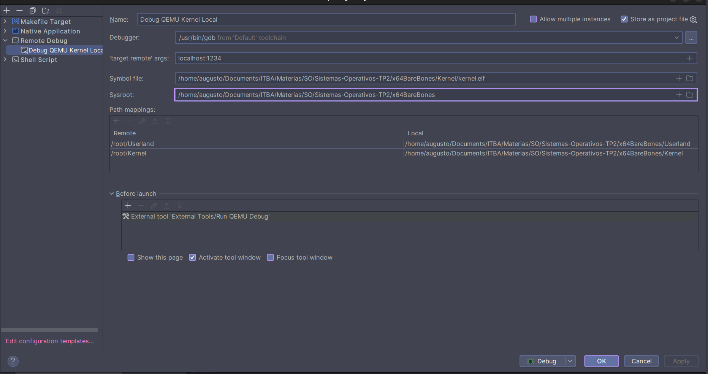
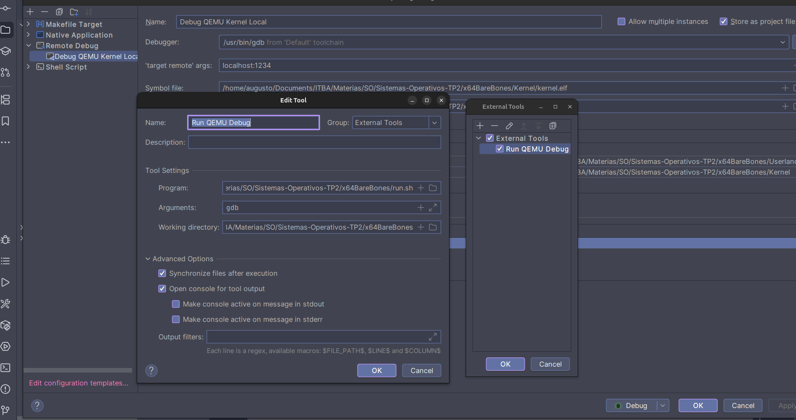

# Guia para debugear

Por ahora esta funcionando muy basico. Para debugear hay que hacer esto:
- Abir terminal grande (no la integrada al ide)
- Correr `./run.sh gdb docker`
- Cuando les abra puden hacer varias cosas:
    - Poner `break main` para poner el brakepoint en main
    - Poner `c` para que corra hasta llegar a main (el brakepoint de antes)
    - Poner `lay src`, `src-prof` (mejor para c) o `asm-prof`(mejor para assembly) para poder ir viendo el pedazo de codigo arriba
    - Poner `n` (next) para ir linea por linea
    - Mañana les cuento mas

# Importantisimo!!!
Se tilda todo el tiempo, no se asusten, gdb es asi. Cuando se les glitchee toda la pantalla pueden hacer dos cosas:
- Tocar `Ctrl + L`
- Escribir `refresh`

Cuando salgan de gdb toquen `Ctrl + C` para que no quede abierto el proceso

## Configuracion para gdb con CLion
La forma en la que esta ahora usa gdb local, no el de docker como dice la guia de la catedra.
Tuve que cambiar cosas en ~/.gdbinit para permitir usar el .gdbinit. Esto lo hice poniendo
`add-auto-load-safe-path /home/augusto/Documents/ITBA/Materias/SO/Sistemas-Operativos-TP2/.gdbinit` al principio de todo.


Y en el external tool de before lunch tengo configurado esto:


```

# Fuentes:
- https://github.com/alejoaquili/ITBA-72.11-SO/blob/main/kernel-development/debugging.md
- https://github.com/cyrus-and/gdb-dashboard